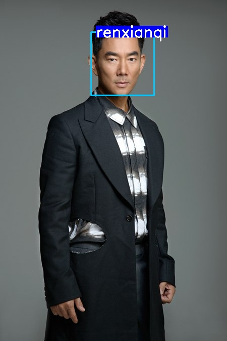
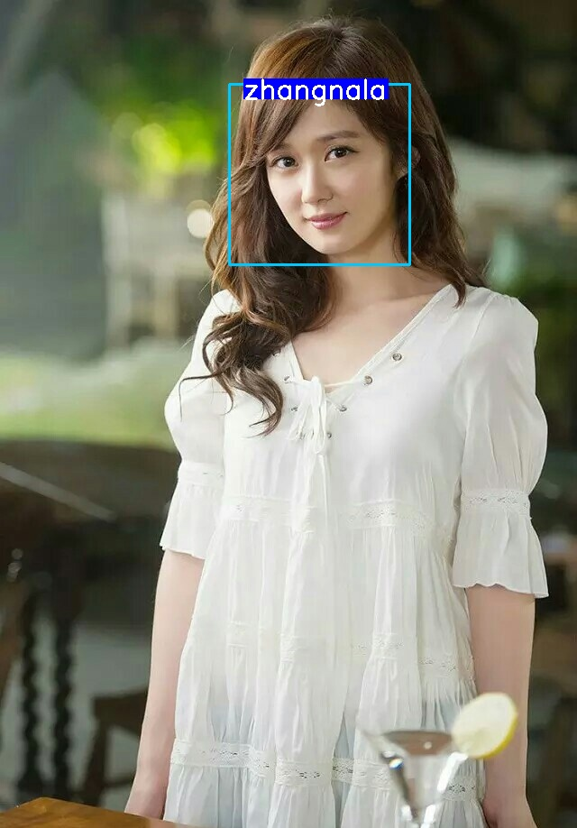

# keras-face-recognition


This is project was created by vgg16 pretrained model.

 Here is the demo
 





## Environment
- python == 3.6
- numpy==1.13.3+mkl
- Keras==2.2.4
- tensorflow = 1.13.1  
- opencv-python==4.1.1+contrib
- keras_vggface = 0.6  
- scipy = 1.2.1


### install requirements
```
pip3 install -r requirements.txt
```

## Run the demo
+ 生成每个人的特征并且存放
放在目录data/original,一个子目录一个人的图片，子目录名字为这个人的人名或者编号

```
python compute_enroll_feature.py
```

+ 测试人脸识别
修改img_path,然后运行
```
python single_test.py
```

## reference 

the code is borrowed from  https://github.com/saiful79/Face_Recognition_using_Keras_and_vggface2
